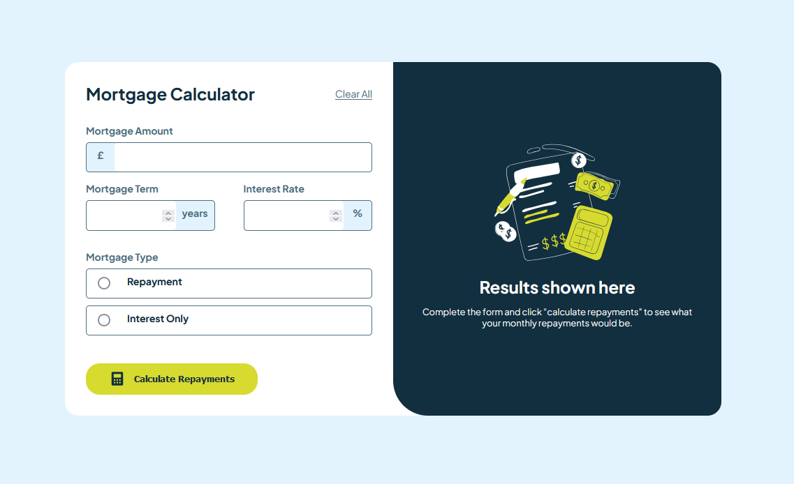
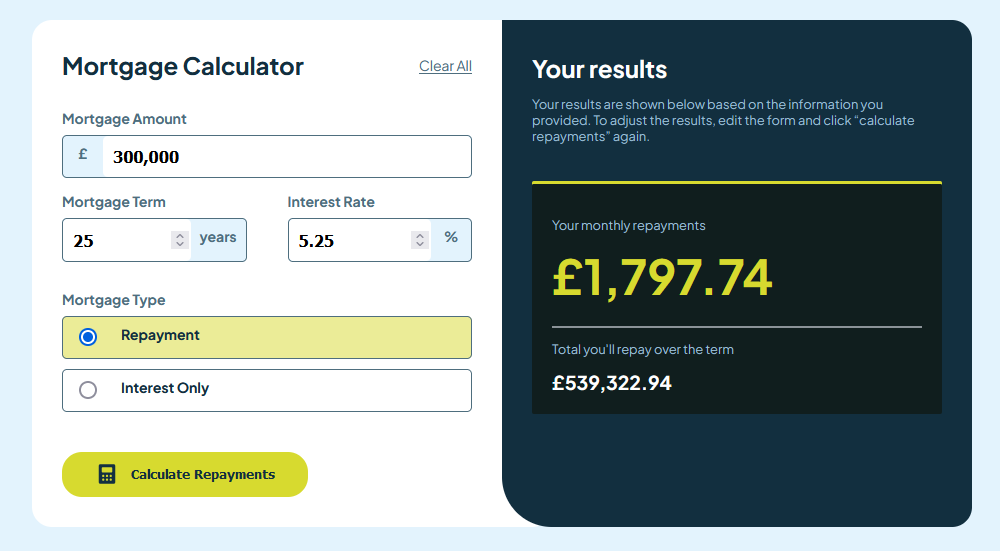

# Mortgage repayment calculator



## Overview

This is a solution to the [Mortgage repayment calculator challenge on Frontend Mentor](https://www.frontendmentor.io/challenges/mortgage-repayment-calculator-Galx1LXK73). In this project, HTML, CSS and JavaScript is used.

- Live Site URL: [Mortgage repayment calculator](https://ktqlee.github.io/FrontendMentor_Projects/4_mortgage_repayment_calculator/index.html)

### Features

**1. Outputing information about monthly repayment and total repayment amounts**

  
   
**2. Providing form validation messages if any field is incomplete**

  

**3. Adjusting layout depending on device's screen size**

  

**4. Providing hover and focus states for interactive elements**

  

**5. Number Formatting**

  - Input formatting (Mortgage Amount) using Cleave library

    
    
    ```html
    <input class="cleave_format_digit" id="mortgage_amount" type="text">
    ```
    ```js
    // Input formatting using Cleave library
    var cleave = new Cleave('.cleave_format_digit', {
        numeral: true,
        numeralThousandsGroupStyle: 'thousand',
        numeralPositiveOnly: true
    });
    ```
    
  - Output formatting using regular expression

    

    ```js
    // Formating number using regular expression
    function add_commas_to_number(x){
        return x.toString().replace(/\B(?=(\d{3})+(?!\d))/g, ",");
    }
    ```
    Reference: https://stackoverflow.com/questions/2901102/how-to-format-a-number-with-commas-as-thousands-separators

**6. Clear All button**

https://github.com/user-attachments/assets/a65fac6e-186c-4540-86db-9bcbedfcd47c
