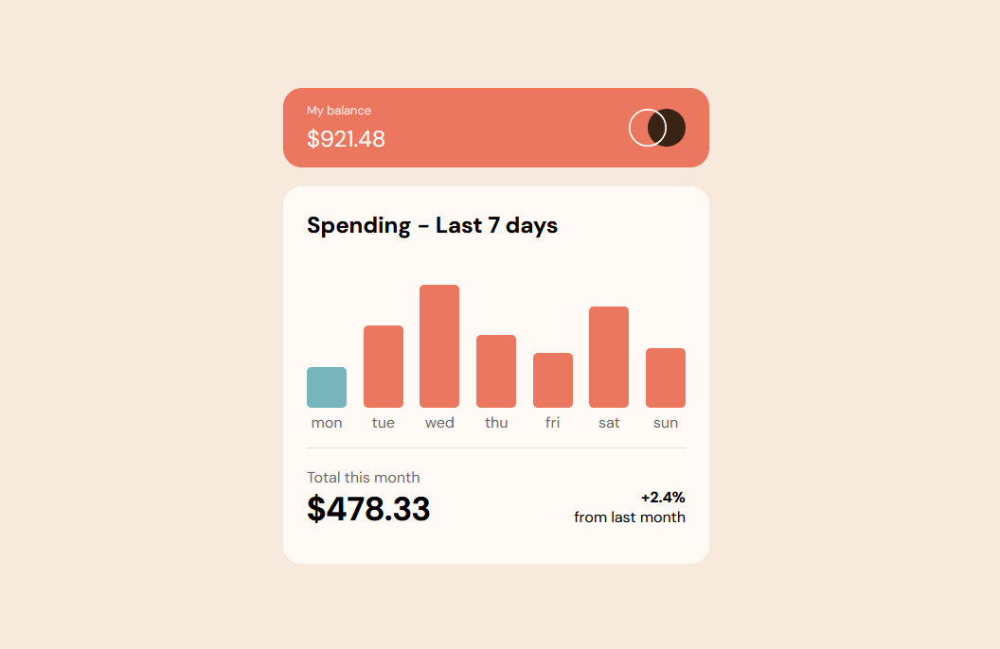
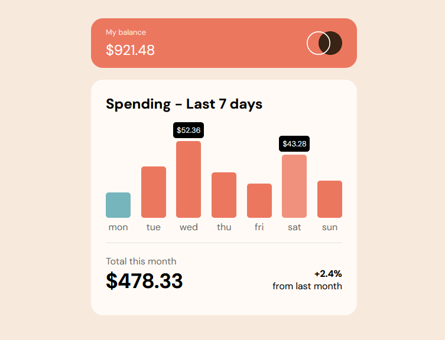
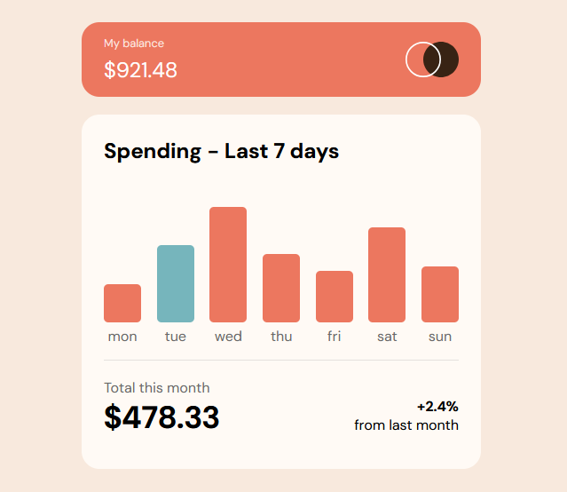
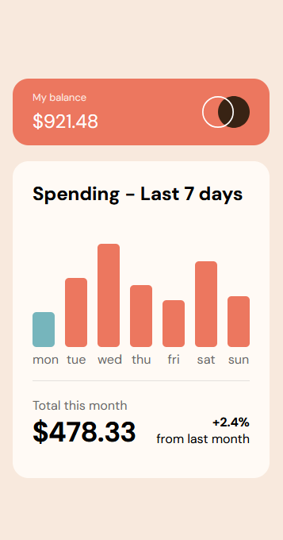

# Expenses chart component



## Overview

This is a solution to the [Expenses chart component challenge on Frontend Mentor](https://www.frontendmentor.io/challenges/expenses-chart-component-e7yJBUdjwt). 

In this project, HTML, CSS and JavaScript are used.

The website will read the data.json file, which include the amount of expenses in the last 7 days, and generate a bar chart based on the amount. Additional JavaScript library such as Chart.js is not used in this project.

- Live Site URL: [Expenses Chart Component](https://ktqlee.github.io/frontendmentor_expenseschartcomponent/)

### Features

#### 1. Get data from JSON file

  ```js
  async function getData(){
    // Get data
    try{
        const response = await fetch("data.json");
        if(response.ok){
            const data = await response.json();
            for(let i = 0; i < 7; i++){
                // append the amount for each day into an array
                spending[i] = data[i].amount;
            }
        }
    }
    // ...
  }
  ```

#### 2. Popup box indicating the actual amount for each day after click event

  

  ```js
  document.getElementsByClassName("bar")[i].addEventListener("click", (e) => {
            // Get the popup box when element bar is clicked
            // barContainer's children [popup box, bar]
            let daySpendingBox = e.target.parentElement.children[0];

            // Alter visibility each time
            if( daySpendingBox.style.visibility == "hidden" ){
                daySpendingBox.style.visibility = 'visible';
            }
            else{
                daySpendingBox.style.visibility = "hidden";
            }
        })
  ```

#### 3. Day of the week highlighted

  View of Tuesday:
  
  

#### 4. Optimal layout for mobile

  


### Generation of bar chart

 - The height of the bar is set to:
  ```
  (Spending of the day / Max Spending in the week) * barCharMaxHeight
  ```

```js
function setData(){

    // spending is an array that stores the amount for each day
    let max = Math.max(...spending);

    // .getDay() output [0-6], which mean [sunday-saturday]
    let day = new Date().getDay();

    for(let i = 0; i < 7; i++){

        // Set the height of bar chart
        let barHeight = ( spending[i] / (max) ) * barCharMaxHeight;
        let bar = document.getElementsByClassName("bar")[i];
        bar.style.height = barHeight + 'px';

        // Set bar color and hover state for current day
        // Since the i represent [monday-sunday], we need to subtract 1 from day
        if( i == ( (day-1) < 0 ? 6 : (day-1) ) ){
            bar.classList.add("today");
        }

    }

}
```
